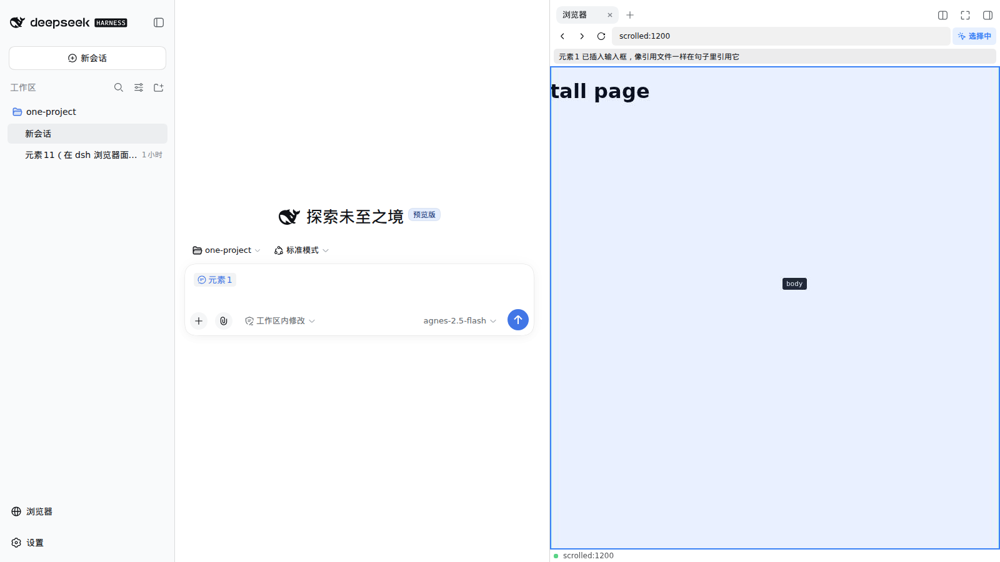

# dsh-plugin-browser

给 [DeepSeek Harness (dsh)](https://github.com/deepseek-ai/deepseek-harness) Web 客户端加一个**内置浏览器面板**：右侧栏实时显示 Playwright Chromium 的画面，可以导航、点击、输入；开启「选择元素」后点击页面元素，元素**截图 + 结构化信息**会作为附件挂到输入框，补充需求后发送给模型。同时注册一组浏览器操作工具，让模型能自主打开页面、截图验收代码修改。



## 功能

- **右侧栏浏览器 tab**：侧栏底部「🌐 浏览器」按钮打开（样式与「设置」行完全一致）；工具栏含后退 / 前进 / 刷新 / URL 栏 / 选择元素开关；画布实时显示页面（CDP screencast，JPEG），鼠标移动、点击、双击、滚轮、键盘都会转发给被控页面。
- **选择元素 → 「元素N」引用 chip**：点击「选择元素」（lucide `MousePointerClick` 图标）后进入选择模式，点击页面元素会立刻以原生引用 chip 的形式把 **元素1、元素2……** 插入 dsh 输入框（与 `@文件` 引用同一机制：Lexical chip 节点，可删除、可撤销、跟随草稿持久化）。像引用文件一样在句子里自由组合：
  > 把元素1和元素2调换位置
  发送时每个 chip 自动展开为该元素的完整信息（选择器 / 标签 / 文本 / outerHTML / 所在页面 URL），模型据此精确定位要改的元素。元素登记表存于 sessionStorage，客户端刷新后已插入的 chip 仍可序列化。**输入框清空（发送完成或手动清空）后计数自动归零**，下一轮从 元素1 重新开始。
- **模型工具**（`browser_navigate` / `browser_screenshot` / `browser_snapshot` / `browser_click` / `browser_type`）：模型可以打开页面、看截图（返回持久化 image 附件，多模态可见）、拿交互元素大纲（`[12] <button> "Submit"` 风格索引）、按索引点击和输入——「改代码 → 自己打开页面 → 截图验收」闭环。`browser_screenshot` 的结果在聊天里渲染为图片卡片。

## 运行环境要求

- dsh ≥ 0.1.5-rc.x，`dsh web`（web profile）
- Node.js ≥ 20
- Playwright Chromium：`npx playwright install chromium`（下载到 `~/.cache/ms-playwright`，无需 root）

<details>
<summary>WSL2/精简系统缺少 libnspr4/libnss3？（免 sudo 方案）</summary>

能 sudo 的话直接 `sudo apt-get install -y libnspr4 libnss3` 最省事。

不能 sudo 时用本仓库自带的脚本（`apt-get download` + `dpkg -x` 解压到插件内，启动时自动注入 `LD_LIBRARY_PATH`）：

```sh
scripts/fetch-deps.sh
```
</details>

## 安装

### 方式一：GitHub 直接安装（免构建）

`lib/` 已随仓库提交，git 安装不需要本地构建：

```sh
npx @deepseek-ai/dsh plugin --profile web add github:TEGONG00/dsh-plugin-browser
npx playwright install chromium
```

> 若 pnpm ≥ 10 因 install scripts 询问授权，本包没有 install scripts，正常情况下不会触发；按 dsh 提示操作即可。

### 方式二：开发模式（--patch，改代码即时生效）

```sh
git clone https://github.com/TEGONG00/dsh-plugin-browser.git
cd dsh-plugin-browser
npm install
npm run build
npx playwright install chromium

# 把 cordis.patch.yml 里的 name 改成你本机的 lib/index.js 绝对路径，然后：
cd ..
npx @deepseek-ai/dsh web --patch ./dsh-plugin-browser/cordis.patch.yml --no-open
```

打开终端输出的 `http://127.0.0.1:3080/?token=…`，侧栏底部点「浏览器」。

## 配置

`cordis.patch.yml` 里 insert 条目的 `config`：

| 字段 | 默认 | 说明 |
|---|---|---|
| `headless` | `true` | 无头运行 Chromium |
| `viewport.width/height` | `1280×800` | 初始视口（面板会实时跟随面板尺寸）|
| `cdpEndpoint` | — | 改为连接已运行的浏览器（`--remote-debugging-port`）|
| `executablePath` | — | 自定义 Chromium 路径 |
| `jpegQuality` | `80` | 画面流与截图的 JPEG 质量（1-100）|
| `navigationTimeoutMs` | `30000` | 导航超时 |
| `hardwareAcceleration` | `auto` | GPU 加速 flags：`auto`（检测到 `/dev/dxg` 才启用）/ `on` / `off`。headless 下常静默回退软件渲染，属尽力而为 |
| `userDataDir` | `~/.cache/dsh-plugin-browser/profile` | 持久化浏览器档案（缓存/Cookie 跨重启保留，二次加载同站明显提速）|

## 清晰度与性能说明（WSL2）

- **清晰度**：面板把 `window.devicePixelRatio` 传给宿主，通过 CDP 设备度量仿真让页面按显示密度渲染位图，高分屏（Windows 125%/150% 缩放）不再发虚；`jpegQuality` 可再调。
- **速度**：浏览器档案持久化，二次打开同一站点走磁盘缓存；视口跟随面板尺寸，渲染像素量与面板成正比。WSL2 的 GPU 直通需要 Win11 + WDDM 2.9 驱动，headless Chromium 即使加 flags 也常回退 CPU 渲染——加载慢主要来自网络与冷缓存，缓存持久化后体感会明显改善。

## 验证

```sh
node scripts/ui-smoke.mjs <token>    # 打开真实 Web UI 走完 面板→导航→选元素→附件 全流程
node scripts/footer-verify.mjs <token>  # 断言「浏览器」与「设置」两行几何一致
```

## 架构速记（基于官方文档的扩展点）

- **tab 注册**：`ctx.sidebarRightTabs.register()` + keyed slot `sidebar.right.pane.tab`（`docs/subsystems/sidebar-right.zh.md`）；入口按钮走 `sidebar.footer.action` list slot，样式逐字复刻设置触发行（行容器 + 42px 按钮 + rail 圆形形态）。
- **client bundle**：package.json 声明 `dsh.client: {platform: 'web'}` + `exports['./client']`，host 自动扫描并经 `/plugins/` 下发；产物是 `window.__ModuleLoader__.load({id, factory})` lazy-CJS（`scripts/build.mjs` 用 esbuild banner/footer 复刻）（`docs/subsystems/client-modules.zh.md`）。
- **元素 chip**：`ctx.inputTriggers.registerSource()` 注册 `@` 触发源（codec.serialize 在提交时把 chip 展开为元素信息）；插入走 `ctx.sessions.binding(id).ctx` → `ctx.conversation.input.for(actx).insertReference()`（`docs/subsystems/` conversation 契约与 `dsh-client-ui-input-trigger` 类型）。TokenSpan 坐标在 detect 空间——每个 chip 占 1 字符，插入锚点 = 剪贴板草稿长度 − Σ(chip 额外宽度)。
- **传输**：`ctx.webServer.register()` 两条自有路由——`GET /dsh-browser/api/stream`（SSE：画面帧/状态/选取事件）+ `POST /dsh-browser/api/cmd`（指令下发），Origin 同源校验（`docs/subsystems/web-server.zh.md`）。
- **图标**：后退/前进/刷新/入口用 dsh 自带图标族 `@deepseek-ai/dsh-client-ui-primitives`（platform module，与「收起侧栏」同源，`currentColor` 跟随主题）；「选择元素」用 lucide-react `MousePointerClick`（tree-shake 后 ~2KB 入 bundle）。
- **工具卡片**：`tool.call.toolview` keyed slot 按 wire 工具名注册（`docs/cookbook/adding-a-tool.zh.md`「Web Client 展示」）。

## 已知限制

- picker 只覆盖主 frame，不穿透 shadow DOM / iframe。
- chip 插入位置为输入框末尾（公共输入 API 不暴露光标偏移，末尾是最接近「光标处」的锚点）；chip 外观为 dsh 标准引用样式（共享组件，无按来源配色钩子）。
- 画面流仅在面板可见时推送（CPU 友好）；隐藏再显示会自动重连。
- 自有路由未接入 dsh 的会话认证（webServer 默认只绑回环，且做了 Origin 同源校验）；不要把 `--host 0.0.0.0` 暴露到不可信网络。
- 「选择元素」依赖真实鼠标事件，被页面自己的 capture 监听器抢先的场景少见但可能。

## License

[MIT](LICENSE)
